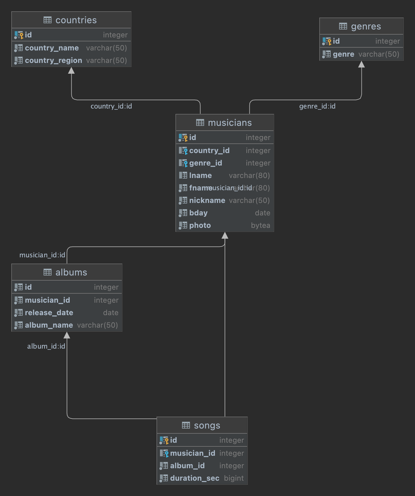

### PostgreSQL DDL statements.
#### Creating test music database using PostgreSQL.

The DB schema is following:



SQL script for tables creation is located under
```
./sql_scripts/ddl_query_execution.sql
```

Creating Tables inside the database using python:

* Install package for Postgres connector
```
$ pip install psycopg2
```

* Setup your connection details for database inside **main.py**

* Run main.py
```
$ python3 main.py
```
